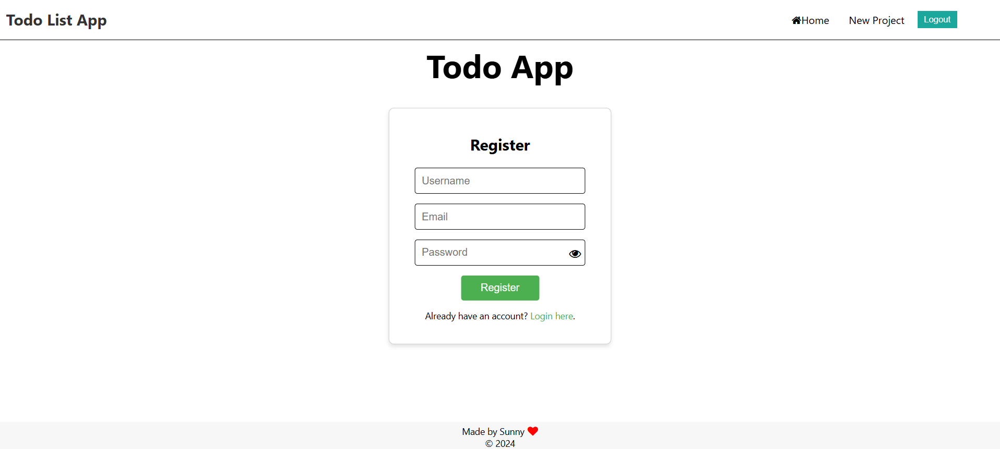

# To-Do List Application

This repository contains the **To-Do List Application** with:
1. React as the frontend (located in this repository).
2. Java Spring Boot as the backend (see [Java Repository](<JAVA_REPO_URL>)).

## Features
- Create, view, update, and delete projects and tasks.
- User-specific project management.
- Export project summaries as `.md` files.
- Integrated MySQL database.

---

## **Setup Instructions**

### **Prerequisites**
- Node.js (for the React frontend)
- Java 17+ (for the Spring Boot backend)
- Maven: Included in the Spring Boot project setup or can be installed separately.
- MySQL (for the database)
- Git (to clone the repository)
- IDE (e.g., IntelliJ IDEA): Recommended for Java development.
- npm (for package management in the React frontend)

---


### **Frontend Setup**
1. **Navigate to the Frontend Folder:**
   Open your terminal and navigate to the `todo-app-frontend` folder:
   ```bash
   cd todo-app-frontend

2. **Install dependencies:**
   ```bash
   npm install

3. **Start the React development server:**
   ```bash
   npm run dev

4. **The application should now be running locally. You can open your browser and access the frontend at:**
   http://localhost:5173


---

### **Backend Setup**
1. **Open the backend folder in IntelliJ IDEA.**

2. **Configure the MySQL database**
   ***Update application.properties in src/main/resources with your MySQL details:***
   ```bash
    spring.datasource.url=jdbc:mysql://localhost:3306/todo_app
    spring.datasource.username=your-username
    spring.datasource.password=your-password


3. **Build and run the backend**
    ***From IntelliJ: Run the TodoApplication class.***

    ***Or from terminal***
   ```bash
    ./mvnw spring-boot:run

4. **Build and run the backend**
    ***Alternative: Build and Run Jar If you want to build a JAR file and run it manually:***
    
   ```bash
    mvn clean package
 
    


4. **The application should now be running locally. You can open your browser and access the Backend at:**
   http://localhost:8080

---
## **Run Instructions**

**Ensure both the frontend and backend are running.**

---
## **Testing**
1. **Frontend Tests:**
   ```bash
   npm test

2. **Backend Test**
   ```bash
   ./mvnw test

-----
## Design Preview

### **Register Page**


### **Login Page**


### **Project Page- Adding Project**


### **Todo Page - Adding todo**


### **Todo Page **


### **Project Page- Update **
